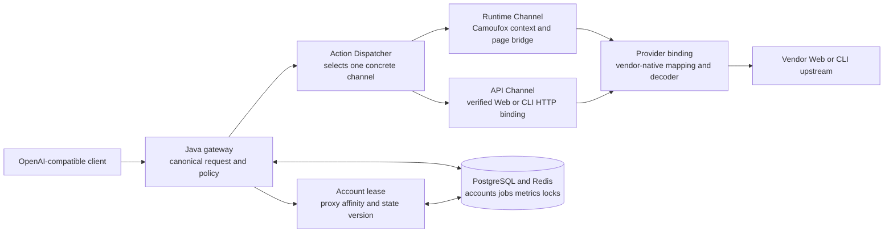

# ADR-0008：Provider 边界与 Arena Direct Runtime 闭环

- 状态：Accepted
- 日期：2026-09-11
- 适用版本：0.16.2
- 关联：ADR-0007《统一 Action 契约并拆分 Runtime / API Channel》

## 决策摘要

框架只提供跨厂商稳定的业务契约、调度、账号隔离、资源预算、状态持久化、错误模型和
观测能力；厂商适配器负责自己的 Web/CLI 协议、页面脚本、接口参数、签名、验证码交互、
媒体上传和事件解码。任何厂商差异都不得上浮到公共协议层，也不得在同一个 Provider 方法
里用 `if api / if runtime` 混合实现。

Arena 本轮只开放语义上的 `direct` 模式。Arena 当前新会话在上游 wire body 中仍要求
`mode=direct-battle`，这是官方页面的内部枚举，不代表对外开放 Battle/Side-by-side 能力；
公共请求不得接受 `direct-battle` 或 `direct_battle` 作为模式别名，也不发送 `modelBId`、
`modelBMessageId` 等 Battle 字段。

## 分层边界



### 框架必须提供

| 领域 | 公共职责 | 不能下沉给 Provider 的规则 |
|---|---|---|
| Action | `register`、`reauthenticate`、`keepalive`、`daily_checkin`、`model_discovery`、`chat`、媒体动作等稳定语义 | 不携带厂商 URL、签名、页面选择器或任意 JavaScript |
| Channel | `RuntimeChannel` 与 `ApiChannel` 的物理出站边界；`AUTO` 只属于 Java 选择策略 | 不把 `AUTO` 传给 Automation；不混用两种渠道的 cookie、storage、fingerprint 和签名状态 |
| 请求契约 | canonical request、semantic command、provider options、controls 的类型校验和 `rawRequest` 隔离 | 不把 OpenAI 原始请求体直接转发给上游 |
| 账号与租约 | 账号选择、并发租约、代理范围、账号切换、凭据版本、credential patch 合并 | Provider 不访问 Repository，不直接改变账号状态或加密凭据 |
| 生命周期 | 注册任务持久化、幂等、目标/尝试/并发上限、退避、取消、事件和 `PENDING -> ACTIVE` 就绪门禁 | Provider 的一次操作结果不能绕过真实探针和账号池门禁 |
| 浏览器平台 | Camoufox/Patchright 进程、隔离 context、session pool、浏览器进程预算、OOM 保护和清理 | Provider 不自行创建无预算的全局浏览器或跨账号复用 context |
| 邮箱与验证码策略 | Temp Mail 客户端、历史邮件快照、超时、统一验证码策略、脱敏日志和人工交互边界 | 不使用未授权的验证码绕过、伪造 token 或把挑战成功写成推测结果 |
| 事件与错误 | canonical event guard、SSE/非流式 renderer、统一错误 envelope、重试分类和指标 | 不把厂商原始 frame 直接暴露给公共 API |
| 能力与验收 | provider manifest、model capability、真实请求证据、Ready/Degraded/Unavailable 状态 | 未经真实账号、模型、媒体和渠道验证不得声明 Ready |

### Provider 可以并且应该自行实现

| 领域 | Provider 责任 | 示例：Arena |
|---|---|---|
| 协议映射 | 将 semantic command 翻译成厂商字段、嵌套、默认值和内部枚举 | `direct` 语义映射为官方新会话所需的 wire `direct-battle` |
| 页面与脚本 | 官方页面入口、脚本加载等待、页面导出函数、DOM/RSC/Storage 提取 | 从当前 Direct 页面发现模型 UUID 和 `uploadFile` |
| 认证与注册 | 临时用户、magic link、密码设置、登录交换、`/api/me` 以及 provider-local 重试 | provisional user、Arena 邮件激活和密码设置 |
| 反滥用交互 | 识别 V3/V2 升级边界，调用官方 widget，并报告人工介入需求 | V3 `chat_submit` 失败或 `prompt failed` 后渲染官方 Enterprise V2 |
| 媒体 | 厂商上传授权、signed upload、文件对象、媒体限制和同会话绑定 | PNG/JPEG/WebP/PDF 通过官方 `uploadFile` 后发送 `experimental_attachments` |
| 事件解码 | 原始流帧、前缀、错误体和终止事件转换前的 provider parser | Arena 一字符前缀 NDJSON 转换为 canonical events |
| 错误分类 | provider-specific 错误码、HTTP 状态、不可重试与可重试边界 | `recaptcha_v2_required`、`prompt failed`、模型不可用和账号拒绝 |
| Provider-local retry | 同一邮箱/页面阶段内的有限重试，避免重复创建身份 | provisional ID 提取、激活链接导航和密码设置 429 的最多 3 次重试 |

定时模型探针由框架统一编排，但是否允许对全量目录发起真实 prompt 属于 Provider
策略。Provider 可以通过 `scheduledModelProbeEnabled()` 关闭广泛定时探针；这不影响
管理员指定模型探针、账号生命周期推理就绪探针，也不影响真实业务请求形成的模型就绪证据。
Arena 因上游对真实 prompt 的反滥用限制关闭该策略，避免把 512 个目录模型的轮询变成
账号级风控流量。

## 注册任务的正确职责链

注册任务的公共部分负责创建和持久化任务、一个 Java attempt 的身份预算、邮箱客户端、
代理租约、浏览器进程预算、事件记录、成功账号导入和 `PENDING` 门禁。Arena 注册器只
负责以下 provider-native 阶段：

```text
page ready
  -> provisional user discovery
  -> anonymous signup
  -> magic-link signup
  -> new Arena verification link
  -> password setup
  -> email session exchange
  -> /api/me identity check
  -> credential result (ready_for_inference=false)
```

已注册账号不因新版本注册失败而删除、重置或覆盖。后续生命周期会继续使用已落库凭据，
先执行 `/api/me` 保活和账号专属文本探针，再决定是否进入 inference pool。Provider-local
失败只写入该注册任务的结构化错误，不改变其他账号状态。

## Arena Direct 对话边界

Arena 的 `chat` Action 只接受公共 `direct` 语义；Search 是同一 Direct Action 的
`modality=search` 变体，不是独立 Battle 模式。图片和 PDF 在同一账号页面 context 中
完成官方 signed upload，上传结果才进入 `experimental_attachments`。音频、视频、远程 URL、
file ID 和未声明文档类型在进入上游前拒绝。

验证码流程固定为：

1. 首次请求使用官方 Enterprise V3 `chat_submit` token。
2. 上游返回 `403 recaptcha validation failed` 或 `429 prompt failed` 时，记录脱敏状态并
   使用官方 Enterprise V2 site key 渲染 widget。
3. 只有官方 widget callback 返回 token 才重试一次；重试 body 使用 `recaptchaV2Token`
   并移除 `recaptchaV3Token`。
4. 超时、渲染失败或没有人工完成 callback 时返回 `recaptcha_v2_required`，不伪造 token，
   不调用第三方绕过服务。

## 迁移与验收规则

- 新 Provider 先声明 Action/Channel binding，再实现单个 provider-native binding；不在
  公共 `protocol`、`routing`、`account` 或 `lifecycle` 模块加入厂商分支。
- Provider-local 重试必须有明确阶段、最大次数、幂等/重复提交风险说明，并将原始错误
  转换成脱敏结构化事件。
- 每个 Runtime/API binding 分别验证模型发现、文本非流式、文本 SSE、账号保活、账号切换、
  媒体上传和失败边界；一套渠道的成功不能推导另一套渠道成功。
- Arena Direct 的发布门禁为文本、Search、图片、PDF 各自的非流式与 SSE 真实成功证据，
  同时满足账号探针、credential patch、Pod Ready、零重启和无新增 OOMKilled。

## 非目标

- 不实现 Arena Battle、Side-by-side、Rerun 或其他多模型比较模式。
- 不把 Runtime 页面请求伪装成厂商公开渠道 API。
- 不绕过 reCAPTCHA、风控、额度、每日签到或账号限制。
