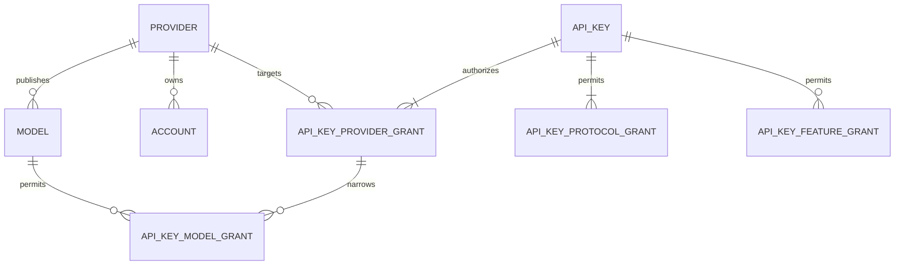

# Data Model

## Aggregate ownership

- Provider aggregate: provider configuration, manifest version, health, and model catalog.
- Account aggregate: identity, operational state, eligibility, credential references, lifecycle state, and version.
- Registration aggregate: campaign, job, attempt, step events, and final account reference.
- Scheduled action aggregate: handler, entity, due time, generation, attempts, lease, and terminal result.
- Session aggregate: tenant, provider, model, account binding, upstream state, context, and expiry.
- Distribution-key aggregate: hashed identity, lifecycle state, provider/model grants, protocol grants, request-feature grants, and usage timestamp.

## Provider, account, model, and key relationships

An account belongs to exactly one provider. Matching email addresses across providers are attributes,
not identity or sharing relationships. A distribution key never binds directly to an account: it
authorizes a provider/model/protocol tuple plus optional request features, then the account selector leases an eligible account of
that provider at request time. This keeps account rotation, cooldown, expiry, and replacement out of
the customer-facing authorization model.

`api_key_provider_grants.all_models = true` grants current and future enabled models for that
provider. Otherwise at least one constrained `api_key_model_grants` row is required. Provider and
model foreign keys prevent dangling grants; application value objects reject ambiguous empty
selected-model scopes. Provider disablement and model disablement remain runtime availability gates,
so a durable grant never overrides a hot-unplug decision.

Request-feature grants are orthogonal to protocol grants. Multimodal input, inline or multipart file
uploads, and tool calling fail closed unless the key grants the corresponding feature. Both direct
provider routes and random routes apply the same authorization object before provider execution.

## Core tables

| Table | Purpose |
|---|---|
| `providers` | Stable identities, code installation state, and administrator enablement |
| `models` | Namespaced model catalog and capabilities JSONB |
| `accounts` | Common indexed account state and non-sensitive metadata |
| `account_credentials` | Versioned encrypted secret payloads |
| `api_keys` | Hash, display prefix, lifecycle state, expiry, quota envelope, and usage timestamp |
| `api_key_provider_grants` | Key-to-provider authorization and current/future model policy |
| `api_key_model_grants` | Explicit model restrictions under a provider grant |
| `api_key_protocol_grants` | Allowed public OpenAI protocol families |
| `api_key_feature_grants` | Optional multimodal, file-upload, and tool-calling permissions |
| `sessions` | Sticky account and provider conversation state |
| `responses` | Durable Responses objects and input context |
| `registration_jobs` | Java-owned automation state |
| `scheduled_actions` | Durable due-time scheduler |
| `outbox_events` | Transactional publication to Redis Streams |
| `usage_events` | Idempotent request telemetry |
| `provider_response_states` | Provider-local Responses continuation state and account affinity |
| `media_assets` | Short-lived private generated media copied from protected upstream URLs |
| `account_model_cooldowns` | Per-account, per-provider, per-model cooldown without degrading unrelated models |

## State and concurrency

`accounts.version` supplies optimistic domain concurrency. Runtime Redis leases protect active upstream use. A lease is not durable account state and never substitutes for the row version.

`scheduled_actions.generation` invalidates stale messages. Only one active generation of an action family may exist for an entity. Workers reject messages whose generation no longer matches PostgreSQL.

`providers.installed` is reconciled from the provider registries at Java startup. `providers.enabled`
is an administrator decision and is never overwritten by plugin discovery. Effective availability
requires both values. Plugin removal preserves durable provider data but retires pending lifecycle
and registration work so an absent implementation cannot produce retry storms.

An upstream `429` writes `account_model_cooldowns` and does not change the account row. Successful
use clears only the matching model cooldown. Ambiguous anti-bot, Cloudflare, transport, and upstream
5xx failures do not mutate account health; only credential rejection or explicit blocked-account
evidence may apply an account-wide cooldown.

Each `registration_jobs` row owns its target success count, attempt budget, concurrency,
within-round attempt start interval, and between-round interval. A fully failed round still uses the
larger of the configured interval and the scheduler's exponential backoff, so operator tuning cannot
disable retry-storm protection accidentally.

`media_assets` never stores an upstream authenticated URL. The provider downloads the bytes while
its account and proxy lease are still active, validates the media type and size, and then stores a
short-lived private copy. Expired rows are not readable even before physical cleanup. Multi-replica
cleanup uses a PostgreSQL transaction advisory lock and bounded batches for both media and model
cooldowns, so deployment scale-up cannot create a synchronized expiry scan storm.

## Read cache hierarchy

PostgreSQL is L3 and remains authoritative. Redis is the rebuildable L2 shared cache. A bounded
Caffeine cache is L1 inside each Java process. API-key authorization snapshots and the public model
catalog use this hierarchy; encrypted credentials and mutable account lifecycle state do not.

Concurrent misses for the same cache key are coalesced into one L3 load per Java process. L1 and L2
have independently configurable TTLs and capacities. Key disable/delete evicts both cache layers only
after the database transaction commits. Redis failure degrades cache reads to PostgreSQL without
changing authorization semantics; it is never treated as a durable permission store or a substitute
for fenced coordination.

## Secret storage

Credentials use AES-GCM envelope encryption. Each row stores ciphertext, nonce, algorithm, key version, and credential version. Searchable identity fields remain separate. Secret payloads are never returned by ordinary account APIs and never written into JSONB metadata.
