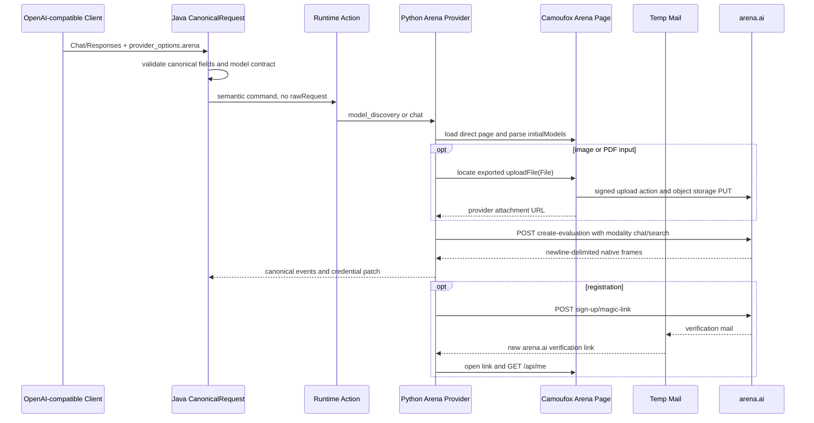

# Arena Web Runtime 适配报告

## 结论

`arena` 已接入仓库现有 Provider、Action、生命周期和模型目录框架，当前实现只使用
Camoufox Browser Runtime。注册、重新认证、保活、模型发现、文本流、图片/PDF 上传和 Web
Search 的 provider-native 映射已经具备代码与自动化契约测试；真实 Arena 账号注册、登录后
推理探针、CI/GitOps/K8S 发布验收尚未执行，因此本适配状态为 `Implemented / Not Ready`。

本轮没有创建外部 Arena 账号，也没有绕过验证码、限流、额度或登录限制。注册器使用共享
Temp Mail，但通过 `single_identity`、`target=1`、`maxAttempts=1` 把测试注册限制为单个
身份。

## 已确认的 Web 协议

2026-09-11 对公开 Arena Web 页面进行低影响协议取证，未发送真实 prompt：

| 观察项 | 结果 |
|---|---|
| 公开页面 | `https://arena.ai/text/direct?model_a=max` 可加载 Direct/Max 页面 |
| 模型目录 | 页面 RSC 中存在 `initialModels`，记录含 provider UUID、显示名、输入/输出能力和可选状态 |
| 模型接口 | `GET /nextjs-api/stream/create-evaluation` 返回 `405`；`OPTIONS` 返回 `204` 且声明 `POST` |
| 未登录状态 | `GET /api/me` 返回 `401` 和 `User not found` |
| 注册入口 | `POST /nextjs-api/sign-up/magic-link` 的空请求返回 `400 invalid request body` |
| 注册方式 | 当前页面使用 email magic link；验证链接在同一页面上下文继续完成登录 |
| 聊天请求 | 页面向 `POST /nextjs-api/stream/create-evaluation` 发送 `mode`、模型 UUID、消息 UUID、`userMessage` 和 `modality` |
| 流事件 | 一字符前缀、换行分隔的 JSON 帧；文本 `0`、数组 `2`、错误 `3`、结束/用量 `d/e`、消息开始 `f`、推理 `g` |
| 媒体上传 | 页面导出 `uploadFile`，内部使用 `generateUploadUrl`、signed upload 和 `getSignedUrl`；聊天随后发送 `experimental_attachments` |
| 当前媒体声明 | 页面 UI 当前声明 PNG/JPEG/WebP 图片与 PDF 文件；本适配不把其他 MIME 类型扩大为已验证能力 |

## 运行链路



## 能力与边界

| 能力 | 当前实现 | 验证状态 |
|---|---|---|
| 自动注册 | 共享 Temp Mail、历史邮件 ID 快照、magic link、`/api/me` 身份核对 | 代码/fixture 通过；未执行外部注册 |
| 重新认证/保活 | 同一账号 Browser Runtime 调用 `/api/me`，401/403 分类为认证失败 | 代码接入；未有真实账号证据 |
| 模型发现 | 从同源 direct 页面提取 UUID、显示名和能力元数据 | parser 契约通过；匿名页面取证通过 |
| 文本非流式/SSE | Java 仍使用统一 OpenAI renderer；Python 读取 Arena 原生帧 | mapper/decoder 测试通过；未有登录后 completion |
| 图片输入 | inline base64 PNG/JPEG/WebP，经页面 `uploadFile` 后发送 signed URL | 页面导出定位与 mapper 测试通过；未有真实 completion |
| 文档输入 | inline base64 PDF，经同一页面上传 | mapper 测试通过；未有真实 completion |
| Web Search | `web_search=true` 映射为 Arena `modality="search"`，并检查目录 Search 能力 | mapper 测试通过；未有真实 Search completion |
| API Channel | 未实现、未声明 | 按范围后置 |

媒体输入只允许 user message 的 inline base64 data URL。每个文件默认上限 20 MiB，总量默认
40 MiB，最多 10 个；远程 URL、file ID、音频、视频和未声明 MIME 类型在进入浏览器流前
失败。上传使用的 signed URL 不写入普通日志；credential patch 只保留经过运行时域名过滤
的浏览器上下文。

## 请求示例

文本和 Search 使用现有 OpenAI-compatible 路由，Arena 私有开关放在 provider namespace：

```json
{
  "model": "arena/Max",
  "stream": true,
  "provider_options": {
    "arena": {
      "web_search": true
    }
  },
  "messages": [
    {"role": "user", "content": "查找并总结今天的公开信息"}
  ]
}
```

图片/PDF 先在公共请求中使用 `input_image` 或 `input_file` 的 inline data URL。Java 只传递
canonical content block 给 Action；Python 页面上传完成后才组装 Arena 的
`experimental_attachments`，不会把 OpenAI 请求体原样转发给上游。

## 错误与发布门槛

Arena 上游错误被归类为 `credential_rejected`、`permission_denied`、`model_unavailable`、
`rate_limited`、`invalid_request_error` 或 `provider_upstream_error`；流协议异常、空输出和
未声明的模型输出分别归为 `provider_protocol_violation`、`empty_model_response` 和
`unsupported_model_output`。注册端额外区分验证码拒绝、限流、重复身份、无效请求、邮件超时
和身份不匹配。

要把 Arena 标为 `Ready`，还需要同一不可变版本完成以下证据：

1. 使用配置好的 Temp Mail 和一条合法代理链完成一次注册，确认账号只进入 `PENDING`。
2. 完成 `/api/me` 保活、模型发现和账号专属文本探针，确认账号进入 inference pool。
3. 对同一账号分别完成文本、Search、图片和 PDF 的非流式与 SSE 请求，并保存去敏化的请求/帧形状、模型、账号、状态码和 canonical terminal event。
4. 运行 CI、构建镜像并完成 GitOps/K8S 的 Pod Ready、零重启、无新增 `OOMKilled`、健康接口和真实用户路径验收。

本报告仅记录代码和协议审计结果，不将未执行的真实上游请求写成成功证据。
