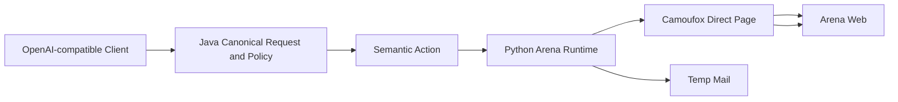

# Arena Web Runtime 适配报告

## 结论

本报告于 2026-09-12 按 K8S 运行态复核结果修订。Arena 只接入 Direct 语义，使用
Camoufox Browser Runtime，不接入 Arena 官方 API/CLI Channel，也不开放 Battle、
Side-by-side 等模式。

0.16.5 已在 K8S 上取得 Arena Direct 的真实文本、Search、图片和 PDF 非流式/SSE 成功样本；
PDF 成功样本使用当前目录声明支持文件输入且账号探针通过的 `claude-sonnet-4-6`。
`Max` 当前不声明文件输入，发送 PDF 时返回明确的能力错误，这是正确的契约门禁。

当前整体状态仍为 `DEGRADED / HEALTH_WINDOW`，不是“所有账号稳定 Ready”：
Arena 账号池现场快照为 9 个账号，其中 8 个 `ACTIVE/enabled`、1 个凭据失效账号；历史
失败账号仍通过生命周期状态隔离，不进入推理池。旧版本恢复失败的直接原因已定位为 Java 生命周期客户端的默认
256 KiB 解码上限触发 `DataBufferLimitException`，不是 TOU 弹窗、reCAPTCHA V3 发放失败
或 Arena 协议解析失败。0.16.5 的受控响应上限已在真实 reauthenticate 和账号探针中生效；
当前剩余阻断是 24 小时健康窗口和历史失败样本，不能通过清理历史指标伪造 Ready。

## 已确认的 Web 协议

低影响协议取证和真实请求共同确认：

| 观察项 | 结果 |
|---|---|
| 公开页面 | `https://arena.ai/text/direct?model_a=max` 可加载 Direct 页面 |
| 模型目录 | 页面 RSC `initialModels` 提供模型 UUID、显示名和输入/输出能力 |
| 聊天请求 | `POST /nextjs-api/stream/create-evaluation`，请求含模型 UUID、消息 UUID、`userMessage` 和 `modality` |
| Direct wire 值 | 新会话内部使用 `mode=direct-battle`；这是官方页面内部枚举，不向公共请求开放 Battle 语义 |
| 流事件 | 一字符前缀、换行分隔的 JSON 帧；文本、工具/Search、结束和错误帧分别由 Provider decoder 处理 |
| 媒体上传 | 页面导出的 `uploadFile` 使用同源 signed upload action，聊天请求随后发送 `experimental_attachments` |
| 首次协议 | `arena_terms state=already_consented` 已在真实请求日志出现；TOU 状态与认证状态分开处理 |
| 验证码 | Enterprise V3 成功发放时记录 `issued/available=true`；只有上游明确要求时才升级官方 V2 widget |

## 分层职责

框架负责 Action/Channel 契约、账号租约、浏览器预算、生命周期、统一错误模型、媒体特征
授权和观测；Arena Provider 负责页面路径、模型 UUID、请求字段、Search modality、TOU
处理、V3/V2 官方验证码边界、媒体上传、原生帧解码和 provider-local 重试。

生命周期自动化返回的浏览器状态上下文由 Java 客户端受控缓冲，配置键为
`ANY2API_AUTOMATION_MAX_RESPONSE_BYTES`，默认 8 MiB，允许范围 256 KiB–32 MiB。
该上限用于容纳合法的浏览器状态回传，同时保留对异常大响应的硬限制，避免用取消限制的
方式引入 OOM 风险。

## 当前真实验收证据

以下记录来自 0.16.5 K8S 运行态，均通过临时测试密钥调用公开 OpenAI-compatible 路由，
测试密钥已在测试结束后清理；账号、邮箱、密钥和内部标识不写入本报告。

| 能力 | 模型/模式 | 非流式 | SSE | 结论 |
|---|---|---:|---:|---|
| 文本 | Arena Direct | HTTP 200、JSON、存在 choices | HTTP 200、`text/event-stream`、6 个数据帧、含 `[DONE]` | 已通过 |
| Search | `Max` + `web_search=true` | HTTP 200、JSON、存在 choices | HTTP 200、`text/event-stream`、14 个数据帧、含 `[DONE]` | 已通过 |
| 图片 | `Max` + inline PNG | HTTP 200、JSON、存在 choices | HTTP 200、`text/event-stream`、4 个数据帧、含 `[DONE]` | 已通过，受账号池稳定性约束 |
| PDF | `claude-sonnet-4-6` + inline PDF | HTTP 200、JSON、存在 choices | HTTP 200、`text/event-stream`、13 个数据帧、含 `[DONE]` | 已通过，限于声明 file 能力的模型 |
| PDF 能力门禁 | `Max` | HTTP 400、`unsupported_parameter`、参数 `input` | 不进入上游流 | 正确拒绝 |

此前 Search 真实流中发现的 provider-native `ac` 工具增量帧已加入 decoder；当前 Search
非流式和 SSE 都能正常完成，未知帧不会被静默当成文本。

### 2026-09-12 K8S 新鲜 smoke 复验

在文档提交后的当前 K8S 制品上，使用集群现有测试密钥以串行、低并发方式重新复验：

| 能力 | HTTP | SSE 数据帧 | 结束/错误 | 耗时 |
|---|---:|---:|---|---:|
| 文本非流式（`Max`） | 200 | — | 1 choice / 无错误 | 20.7s |
| Search 非流式（`Max`） | 200 | — | 1 choice / 无错误 | 19.6s |
| Search SSE（`Max`） | 200 | 9 | `[DONE]` / 无错误 | 20.7s |
| 图片非流式（`Max`） | 200 | — | 1 choice / 无错误 | 29.0s |
| 图片 SSE（`Max`） | 200 | 7 | `[DONE]` / 无错误 | 33.8s |
| PDF 非流式（`claude-sonnet-4-6`） | 200 | — | 1 choice / 无错误 | 54.1s |
| PDF SSE（`claude-sonnet-4-6`） | 200 | 8 | `[DONE]` / 无错误 | 66.8s |

本轮请求均为 `attempt=1/status=SUCCEEDED`；服务端日志未出现新的
`DataBufferLimitException`，自动化 Pod 在复验前后均为 Ready 且重启次数为 0。

## 媒体和请求边界

- 图片只声明 PNG、JPEG、WebP；文档本轮只声明 PDF。
- 输入必须是 user message 中的 inline base64 data URL；远程 URL、file ID、音频、视频和
  未声明 MIME 类型在进入浏览器流前失败。
- 单文件默认上限 20 MiB，总量默认 40 MiB，最多 10 个文件。
- 图片 data URL 同时需要分发密钥的 `MULTIMODAL_INPUT` 与 `FILE_UPLOADS` feature；这是
  inline 文件授权规则，不是 Arena 上游错误。
- Search 只有在当前 Arena 模型目录声明 Search 能力时才发送 `modality=search`。

## 验证码和首次协议边界

请求前会在同一浏览器页面检查并处理官方 TOU 状态；已同意时继续请求，未同意时由官方
页面协议流程处理。reCAPTCHA 只允许使用官方页面生成的 Enterprise V3 token；如果上游
明确返回 `recaptcha validation failed` 或 `prompt failed`，才渲染官方 V2 widget。没有
官方 callback token 时，系统返回 `recaptcha_v2_required`，不伪造 token、不绕过验证。

因此，V2 人工交互或上游策略升级是明确的 readiness 边界；它不应被伪装成普通账号、协议
或模型错误。:codex-annotation{index="1"}

## 账号生命周期和未完成项

现场账号聚合如下：

| 状态 | 数量 | 说明 |
|---|---:|---|
| `ACTIVE/enabled` | 8 | 当前可进入 inference pool |
| `PENDING/disabled` | 0 | 已完成账号专属推理探针 |
| `EXPIRED/disabled` | 1 | 上游凭据返回 401 后进入重新认证流程 |
| `DEGRADED/disabled` | 0 | 当前没有新的 DEGRADED 账号 |

旧版本恢复事件大量出现 `automation_transport_error`，详细原因为
`DataBufferLimitException`；这发生在 Java 读取 Automation 返回的浏览器状态上下文阶段。
0.16.5 的响应缓冲修复已发布并取得多笔 reauthenticate 与账号探针成功；当前仍需持续观察
过期凭据是否自然恢复和 24 小时窗口指标。后续验收顺序为：

1. 观察 PENDING/EXPIRED 账号的 `reauthenticate` 是否能完成并写回 credential patch。
2. 对恢复账号执行账号专属 inference probe，确认进入 inference pool。
3. 使用至少两个不同账号分别完成文本、Search、图片和 PDF 的非流式/SSE 请求。
4. 观察 24 小时成功率、P95、账号切换和浏览器预算，不清理历史失败来伪造 Ready。

## 发布与回滚

- 当前制品：`0.16.5`，功能源码提交 `0075462`，包含生命周期响应缓冲修复和对应回归测试；
  文档复验提交为 `1883585`。
- CI `34628549967`（源码修复）和 `34631703153`（验收文档）均通过全部质量检查、三套镜像
  构建和 `update-gitops`；当前 GitOps revision 为 `291debf…`，Argo CD 状态为
  `Synced/Healthy/Succeeded`。
- K8S server、automation、web 均运行 `*-sha-1883585…` 不可变镜像，业务 Pod Ready、
  重启 0；当前未发现 `OOMKilled`、`OOMKilling` 或发布后的 `DataBufferLimitException`。
- 若 0.16.5 发布后出现回归，Backend/Web/Automation 可回滚到上一不可变 0.16.4 SHA 镜像；
  不删除或重置已有 Arena 账号。

## API Channel

Arena 本轮不实现、不声明官方 API/CLI Channel；当前所有真实请求均通过同一套 Arena
Camoufox Browser Runtime。后续若实现 API Channel，必须另建 provider-local 协议、认证、
签名、媒体和错误映射，不得把 Arena 页面 wire 值或浏览器凭据上浮到公共层。
